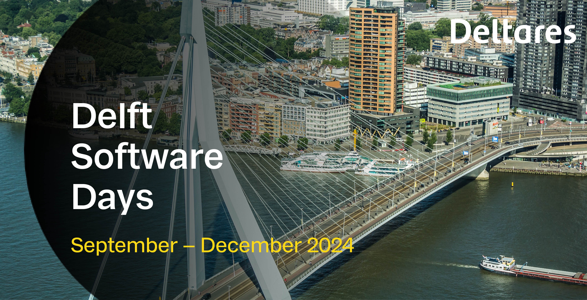

# Course Description
The purpose of this 1-day workshop is to introduce participants to MODFLOW 6 and its growing set of (advanced) simulation capabilities. For each topic included in the training, there will be a short lecture on the underlying concepts and implementation followed by a live demonstration or exercise. These exercises will use the Python language, Jupyter Notebooks, and the FloPy Package to create, run, and post-process MODFLOW 6 simulations.

# Getting Started
Windows Subsystem for Linux (WSL) is a straight forward way for Windows users to get started using the extended version of MODFLOW. Instructions for setting up WSL and compiling the extended version of MODFLOW is provided in [wsl_setup.md](./wsl_setup.md).

If you are using the MacOS or Linux operating system you can follow the instructions in [wsl_setup.md](./wsl_setup.md) starting at the [Clone the class repo](./wsl_setup.md#Clone-the-class-repo).

# Agenda
* Welcome and Introductions
* Overview of MODFLOW 6 and FloPy
* Hands-on exercise I: setup a FloPy model and run
* Extended MODFLOW 6: context and applications
* == BREAK
* Extended MODFLOW 6: context and applications - wrap up
* Hands-on exercise II: watershed GWF and GWT models
* Aquifer storage and recharge
* == LUNCH ==
* Aquifer storage and recharge - wrap up
* Variable Density Flow
* Hands-on exercise III: extended Henry problem with a tidal boundary
* == BREAK ==
* MODFLOW API: context and applications
* Hands-on exercise IV: Alter the behavior of an existing MODFLOW package
* Discussion and Wrap up

